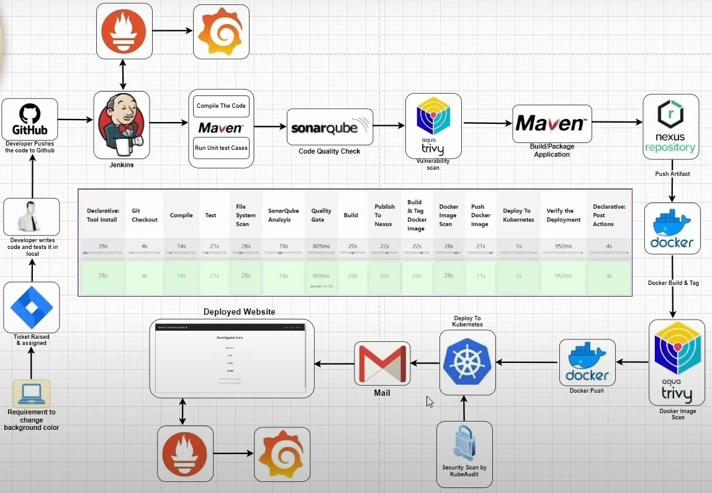

# Spring Pet Clinic - DevOps Pipeline Implementation



**Description**:
This project implements a CI/CD pipeline using Jenkins for the Spring Pet Clinic application. It includes:

* Automated build & test using Maven
* Security scans using Trivy & SonarQube
* Docker containerization
* Kubernetes deployment to a self-hosted cluster


### **Technologies Used**
| Category | Tools |
|----------|----------------|
| Version Control | Git, GitHub |
| CI/CD | Jenkins|
| Build & Test | Maven |
| Repository | Nexus|
| Security | Trivy, SonarQube |
| Containerization | Docker |
| Deployment | Kubernetes |

---
### **Features & Stages in the Jenkins Pipeline**
| Stage | Description |
|-------------------|--------------------------------------------------|
| **Git Checkout** | Clones the repository from GitHub |
| **Code Compilation** | Compiles the Java application using Maven |
| **Code Testing** | Runs unit tests to validate functionality |
| **Security Scans** | Uses **Trivy** for file system & Docker image scans |
| **SonarQube Analysis** | Checks code quality & vulnerabilities |
| **Build & Package** | Packages the application into a JAR file |
| **Push to Nexus** | Uploads artifacts to Nexus Repository |
| **Docker Build & Push** | Builds a Docker image & pushes to Docker Hub |
| **Kubernetes Deployment** | Deploys application on Kubernetes |

---

### **Project Structure**
```
SPC-Deployment/
├── Jenkinsfile              # Jenkins pipeline definition
├── k8s/                     # Kubernetes deployment files
│   └── deployment-service.yaml
├── pom.xml                  # Maven project configuration
├── Dockerfile               # Docker image definition
├── src/                     # Source code
│   └── main/
│       └── java/
│           └── org/
│               └── springframework/
│                   └── samples/
│                       └── petclinic/
│                           └── ...
|
└── README.md                # Project overview
```

### **Setup & Execution**
1.  **Clone the repository:**
    ```bash
    git clone https://github.com/Pratik-Ahire-git/SPC-Deployment.git
    cd SPC-Deployment
    ```
2.  **Configure Jenkins:**
    *   Install necessary plugins (Maven, Docker, Kubernetes, SonarQube, etc.).
    *   Set up global tools (JDK, Maven, Docker, etc.).
    *   Create a new pipeline job and point it to the `Jenkinsfile`.
3.  **Configure SonarQube & Nexus:**
    *   Deploy SonarQube & Nexus as Docker containers.
    *   Configure Jenkins to connect to SonarQube & Nexus.
4.  **Set up Kubernetes:**
    *   Set up a self-hosted Kubernetes cluster.
    *   Configure Jenkins to connect to the cluster using `kubectl`.
5.  **Run the Pipeline:**
    *   Trigger the Jenkins pipeline to start the CI/CD process.
6. **Deploy to Kubernetes**
    ```bash
    kubectl apply -f k8s/deployment-service.yaml
    ```
7. **Verify Deployment**
    ```bash
    kubectl get pods -n webapps
    kubectl get svc -n webapps
    ```


### **Troubleshooting**
*   **"No Space Left on Device" Error:**
    *   Run `docker system prune -a -f` to clean up old Docker images & containers.
    *   Run `sudo rm -rf /var/lib/docker/tmp/*` to remove unused Docker temp files.
    *   Increase Jenkins worker disk space.
    *   Automate cleanup scripts to manage storage.
